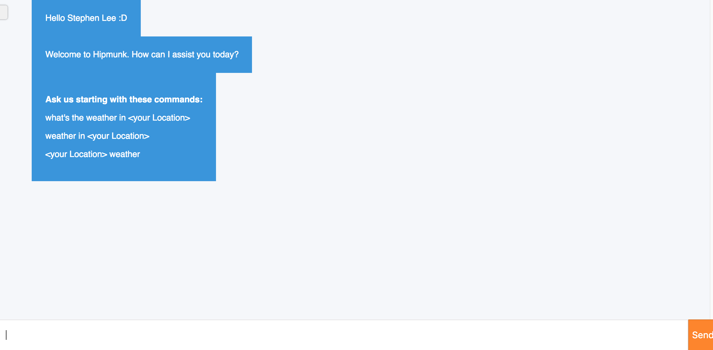
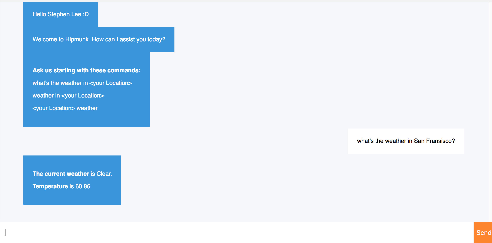
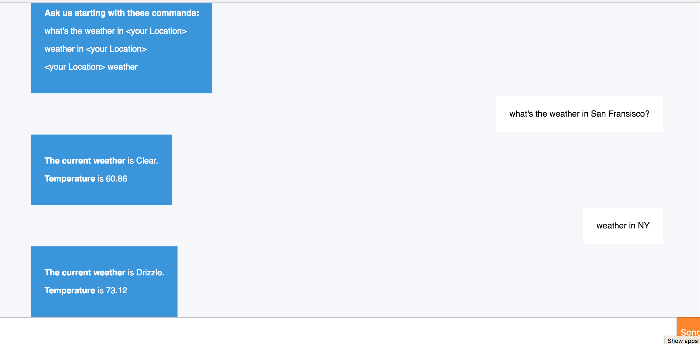
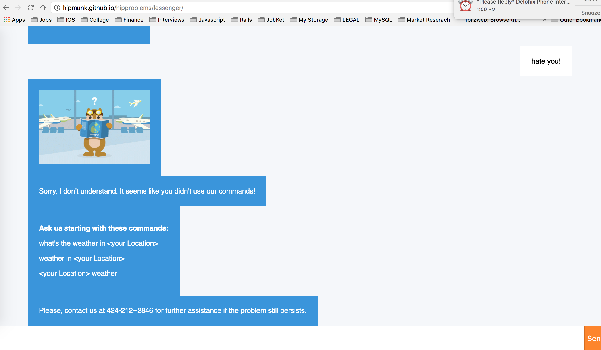

# hipmunk-lmessenger-sl

Before we begin, make sure you have `keys.json` in this repo.

### Setup

```bash
$ npm install
```
### Running the Express server

```bash
$ node server.js
```
Then, go to http://hipmunk.github.io/hipproblems/lessenger/

### Tools and APIs

[darksky](https://darksky.net/dev/docs/forecast)

[geocoder for node js](https://www.npmjs.com/package/node-geocoder)

[hipmunk API doc](https://github.com/Hipmunk/hipproblems/tree/master/lessenger)

[node fetch](https://www.npmjs.com/package/node-fetch)

[cors](https://github.com/expressjs/cors)
 

### Demo

Type your name.


Introduction from my bot


Valid commands



Invalid commands



### Enjoy!
